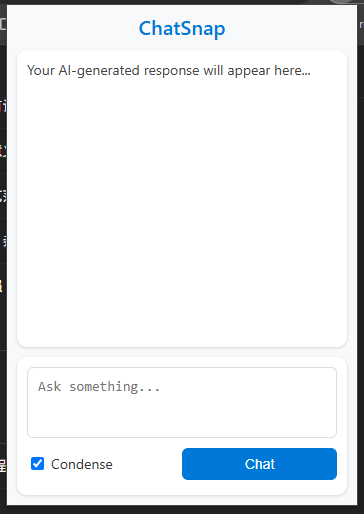

📘 ChatSnap

ChatSnap is a lightweight Chrome extension that lets you query Gemini Nano directly from your current browser window — no need to open extra tabs or switch pages.

With ChatSnap, you can instantly ask Gemini questions, get fast responses, and optionally enable a Condense Mode for shorter, more concise answers.

✨ Features

🧠 Gemini Nano integration – access Gemini directly within Chrome

⚡ Instant interaction – open the extension and start chatting immediately

💬 Condense Mode – toggle for brief, summarized responses

🎨 Simple and clean UI – optimized for quick productivity

🧩 Installation

Clone or download this repository:

git clone https://github.com/<your-username>/chatsnap.git

Open Chrome and go to:
chrome://extensions/

Enable Developer mode (top-right corner).

Click Load unpacked and select the ChatSnap project folder.

You’ll now see the ChatSnap icon appear in your Chrome toolbar 🎉

🚀 Usage

Click the ChatSnap icon in your Chrome toolbar.

Type your question into the input box and press Enter or click Chat.

Optionally check the Condense box for shorter, more direct answers.

View Gemini’s response right inside the extension window.

🧠 Example

User: What is quantum computing?
Gemini (Condensed): A field that uses quantum mechanics to process data in parallel through qubits, offering exponential speedup for some problems.

🛠️ Tech Stack

Frontend: HTML, CSS, JavaScript

Platform: Chrome Extensions (Manifest V3)

AI Model: Gemini Nano

📷 Screenshots

🤝 Contributing

Contributions, issues, and feature requests are welcome!
Feel free to open an issue or submit a pull request.

📄 License

This project is licensed under the MIT License
.